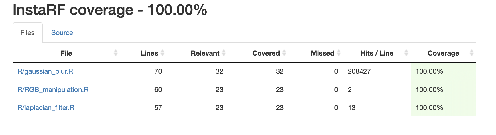
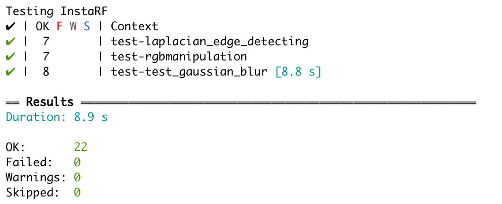
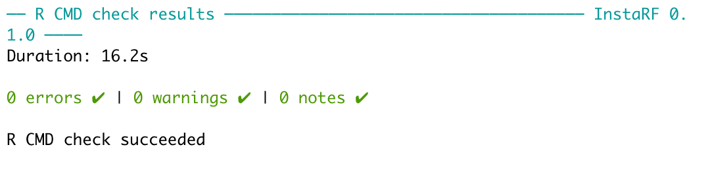

# InstaRF Proposal


## Contributors:

Betty Zhou     
Linyang Yu    
Reza Bagheri    
Simon Chiu    

## Overview

Image processing uses computer algorithms to enhance an image or to extract useful information from it. In this package, we have implemented some R functions for image processing. These functions perform Gaussian blurring, Laplacian edge detection, and color changing.

## Functions

1. **Gaussian Blur**    
   This function performs convolution to de-emphasize differences in adjacent pixel values with a Gaussian distribution. The blurring effect removes detail and noise in the input image.
2. **Laplacian Edge Detecting**    
   This function performs convolution to emphasize differences in adjacent pixel values. The function detects edges by sharpening/highlighting the edges of an image.
3. **RBG Manipulation**    
   This function adjusts the red, blue and green intensity of an image by applying different weights for each RBG channel. This is similar to a colour filter in Instagram.

## R Ecosystem

[InstaR]( https://github.com/UBC-MDS/InstaR/tree/v4.0) is a R package that contains the three functions: blur, flip and greyscale to transform images. It is important to note that are several packages that have similar image processing functionality (e.g. spatstat has its own Gaussian blur function). In this project, we plan to implement three more image processing functions in R by exploring additional filters.

## Repo structure:

#### InstaRF
  * R: [R](R/) folder contains all of our functions:
    * gaussian_blur.R
    * laplacian_filter.R
    * RGB_manipulation.R
  * Testing Units Design: [test_r](test_r/)
    * Contains images for testing: [test_image](test_r/test_image/)
    * Testing units for Gaussian Blurring: [test_gaussian_blur.R](test_r/test_gaussian_blur.R)
    * Testing units for Laplacian edge: [test_Laplacian_edge_detecting.R](test_r/test_Laplacian_edge_detecting.R)
    * Testing units for RGB channel: [test_RGB_manipulation.R](test_r/test_RGB_manipulation.R)
  * [CONTRIBUTING.md](CONTRIBUTING.md)
  * [Code_of_CONDUCT.md](Code_of_CONDUCT.md)
  * [LICENSE](LICENSE)
  * README.md
  
## Installation (*** needs update ***)

Installing InstaRF is easy with only the following two steps:

1. Open your R studio
2. Enter ```devtools::install_github("UBC-MDS/InstaRF", build_opts = c("--no-resave-data", "--no-manual"))``` to console.
[Devtools_syntax_update](https://github.com/r-lib/devtools/issues/1896)

## Usage

```library(InstaRF)```

## Functions 

#### 1. Gaussian Blur
```gaussian_blur(input_image_path, output_image_path, filter_shape = (3,3), sigma = 1)```

Arguments:

* ```input_image_path```: Path to the input image
* ```output_image_path```: Path to the output image
* ```filter_shape```: Size of the filter
* ```sigma```: Standard diviation of the gaussian distribution (higher sigma size allows stronger blurring)

Example:

```gaussian_blur("test/test_image/carnovsky_RGB_1.png", "test/test_image/test.png", filter_shape = (3,3), sigma = 1)```

Before:


After:


#### 2. RGB manipulation
```RGB_manipulation(input_path, output_path, R = 2, G = 2, B = 2)```

Arguments:

* ```input_path```: Path to the input image
* ```output_path```: Path to the output image
* ```R```: Adjusting intensity for red channel (integer)
* ```B```: Adjusting intensity for blue channel (integer)
* ```G```: Adjusting intensity for green channel (integer)

Example:
```RGB_manipulation("test/test_image/carnovsky_RGB_1.png", "test/test_image/Carnovsky_RGB_manipulated.png", R = 1, G = 1, B = 5)```

Before:


After:


#### 3. Laplacian Edge Detecting
```laplacian_edge_detecting(input_image,  output_image)```

Arguments:

* ```input_path```: Path to the input image
* ```output_path```: Path to the output image

Example:

```laplacian_filter("test/test_image/IMG_2036.PNG", "test/test_image/IMG_2037.PNG")```

Before:


After:


## Branch coverage

The package passed all the tests that were planned before.

It had 100% branch coverage:



The functions passed all the tests:



and R cmd test was also passed:




## Package dependencies
|||
|---|---|
|testthat|             png|
